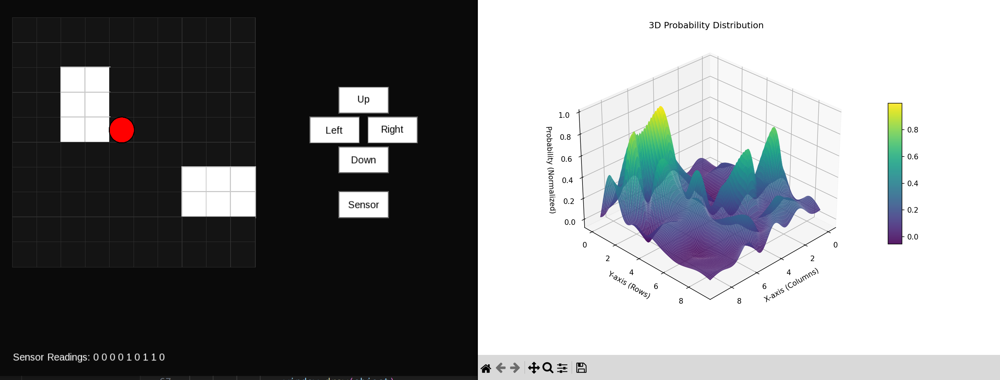

# Robot Localization
This project implements a robot localization algorithm that leverages Bayesian updates to estimate the robot's position in a 2D grid environment. It's designed for educational purposes and can be applied to robotic navigation in uncertain environments.

## How it Works
- Robot Localization: Uses Bayesian updates to estimate the robot's position on a 2D grid.
- Sensor Model: Simulates noisy sensor data to mimic real-world conditions and adjusts probabilities accordingly.
- Motion Model: Predicts the robot's new state and updates the probability distribution when the robot moves.
- Visualization: Real-time 3D plot of the probability distribution using matplotlib.

## Features
- 2D grid-based environment
- Bayesian probability updates
- Real-time 3D visualization of probability distribution
- SFML-based GUI

## Demo 


## Prerequisites
- C++
- CMake 3.10+
- SFML 2.5+
- Python 3.8+
- matplotlib
- numpy
- scipy

## Installation

### Install Dependencies
```bash
# Ubuntu/Debian
sudo apt-get update
sudo apt-get install cmake libsfml-dev python3-dev python3-numpy python3-matplotlib python3-scipy
```

### Build from Source 
```bash
# Clone repository
git clone https://github.com/YOUR_USERNAME/robot-localization.git
cd robot-localization

# Build
chmod +x [build.sh](http://_vscodecontentref_/1)
[build.sh](http://_vscodecontentref_/2)

# Run
cd build
./robot_simulator
```

### System-wide Installation (optional)
```bash
cd build
sudo make install
```

## Usage
```bash
# Run the simulator
./build/robot_simulator
```